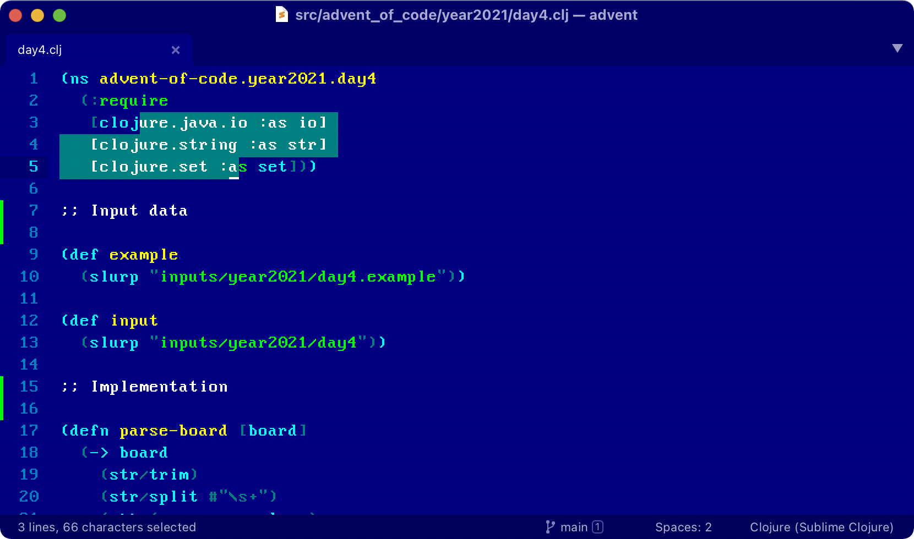

# Commander Color Scheme

A retro color scheme for Sublime Text.



Font: [More Perfect DOS VGA](https://laemeur.sdf.org/fonts/)

Settings:

```
{
  "block_caret": true,
  "color_scheme": "Commander.sublime-color-scheme",
  "font_face": "More Perfect DOS VGA",
  "font_size": 16,
}
```

## Installation

1. Clone this repository to `~/Library/Application Support/Sublime Text/Packages`
2. `UI: Select Color Scheme`
3. `Commander`

## See also

[Alabaster Color Scheme](https://github.com/tonsky/sublime-scheme-alabaster): minimal color scheme for coding.

[Writer Color Scheme](https://github.com/tonsky/sublime-scheme-writer): minimal color scheme for long-term writing.

[Profile Switcher](https://github.com/tonsky/sublime-profiles): Switch quickly between writing and coding profiles.

[Fira Code](https://github.com/tonsky/FiraCode/): Best coding font in the world.

## Credits

Made by [Niki Tonsky](https://twitter.com/nikitonsky).

## License

[MIT License](./LICENSE.txt)